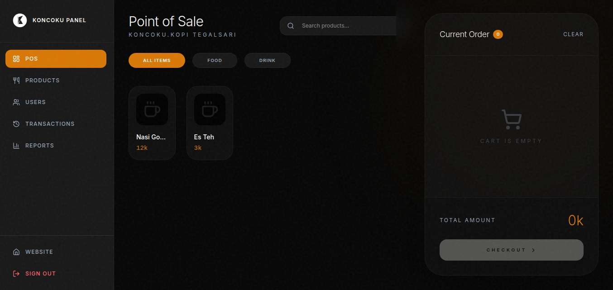

# KONCOKU.KOPI

A modern landing page and integrated Point of Sale (POS) system for KONCOKU.KOPI, a private coffee space in Tegalsari, Banyuwangi. Built to serve both customers seeking a quiet space and staff managing daily coffee shop operations.




## ✨ Features

**For Customers:**
- **Landing Page:** Beautifully designed website showcasing the coffee shop's vibe, menu, and philosophy.
- **Responsive Layout:** Works flawlessly on mobile and desktop.
- **Location & Information:** Quick access to opening hours and map directions.

**For Staff & Admins (Dashboard & POS):**
- **Point of Sale (POS):** Streamlined order processing for cashiers with an intuitive cart system.
- **Product Management:** Complete CRUD operations for menu items and categories.
- **Transaction History:** Log, view, and void past sales and invoices.
- **Daily Reports:** Visualized analytics for daily revenue and best-selling products.
- **User Management:** Role-based access control (Admin, Cashier, Customer).

## 🛠 Tech Stack

**Frontend:**
- [React 18](https://react.dev/)
- [TypeScript](https://www.typescriptlang.org/)
- [Vite](https://vitejs.dev/)
- [Tailwind CSS](https://tailwindcss.com/)
- [Framer Motion](https://motion.dev/) (Animations)

**Backend as a Service:**
- [Firebase Authentication](https://firebase.google.com/products/auth)
- [Firebase Firestore](https://firebase.google.com/products/firestore) (Real-time NoSQL Database)

**Libraries & Tools:**
- [Lucide React](https://lucide.dev/) (Icons)
- [Recharts](https://recharts.org/) (Data Visualization)
- [React Router](https://reactrouter.com/) (Routing)

## 📦 Installation

1. **Clone the repository:**
   ```bash
   git clone https://github.com/ngetikin/koncokukopi.git
   cd koncokukopi
   ```

2. **Install dependencies:**
   ```bash
   npm install
   ```

3. **Set up Firebase:**
   Create a `.env` file in the root directory based on `.env.example` and add your Firebase configuration:
   ```env
   VITE_FIREBASE_PROJECT_ID="your-project-id"
   VITE_FIREBASE_APP_ID="your-app-id"
   VITE_FIREBASE_API_KEY="your-api-key"
   VITE_FIREBASE_AUTH_DOMAIN="your-auth-domain"
   VITE_FIREBASE_DATABASE_ID="your-database-id"
   VITE_FIREBASE_STORAGE_BUCKET="your-storage-bucket"
   VITE_FIREBASE_MESSAGING_SENDER_ID="your-messaging-sender-id"
   VITE_FIREBASE_MEASUREMENT_ID="your-measurement-id"
   ```

## 🚀 Usage

**Development Server:**
Start the Vite development server on port 3000:
```bash
npm run dev
```

**Production Build:**
Build the app for production:
```bash
npm run build
```

Preview the production build:
```bash
npm run preview
```

## 📁 Project Structure

```
├── public/                 # Static assets (Favicons, robots.txt, sitemap.xml)
├── src/
│   ├── components/         # Reusable UI components (Modals, Layouts, Logo)
│   ├── contexts/           # React Context (AuthContext)
│   ├── lib/                # Utility functions and Firebase configuration
│   ├── pages/              # Application Routes (Home, POS, Admin Dashboard)
│       ├── admin/          # Admin-specific pages (Products, Reports, etc.)
│   ├── types/              # TypeScript interface definitions 
│   ├── App.tsx             # Main Application Component & Routing
│   └── main.tsx            # Entry point
├── .env.example            # Example environment variables
├── firebase-blueprint.json # Initial Firestore schema mock
├── firestore.rules         # Firebase Security Rules
├── package.json            # Dependencies and scripts
├── tailwind.config.js      # Tailwind CSS configuration
└── vite.config.ts          # Vite bundler configuration
```

## 📄 License

This project is licensed under the MIT License.
